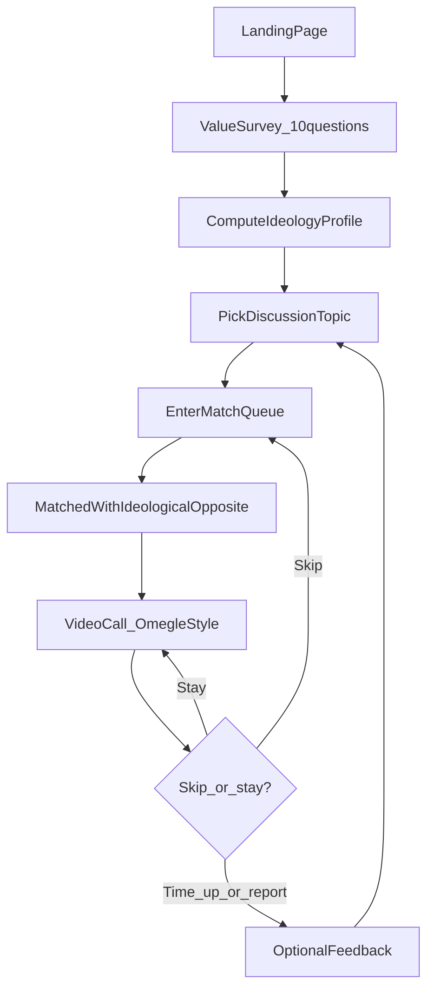
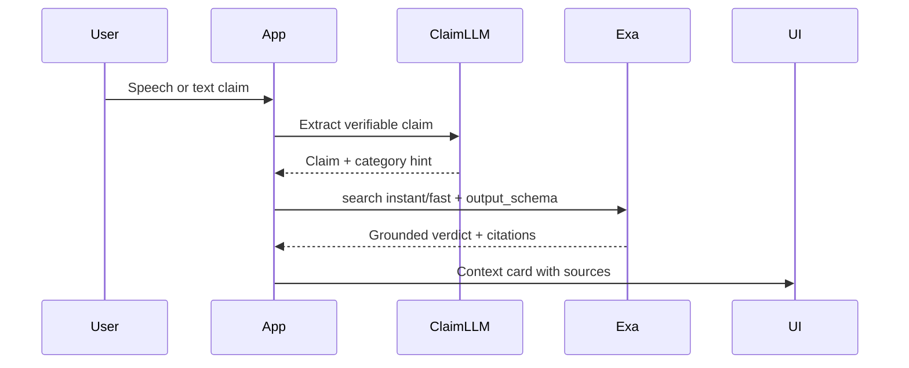

# Parallax — Product Requirements Document & Tech Stack

## Product name

**Recommended: Parallax**

Parallax is the shift in perspective when you view something from a different position — a precise metaphor for the product goal without sounding partisan. It is short, memorable, and works as a verb ("Parallax someone on capital gains tax").

**Alternatives** (if Parallax is taken as a domain/trademark):
- **Steelman** — references the rhetorical practice of presenting the strongest version of an opposing argument
- **Parley** — diplomatic dialogue; warm and approachable
- **Across** — minimal, modern ("meet someone Across")

The existing repo name **The Inbox** reads like email and does not communicate the product; rename the repo to `parallax` (or keep monorepo root name and use Parallax in product UI).

---

## Problem statement

Political and ideological polarization is reinforced by algorithmic echo chambers. People rarely encounter good-faith opponents in structured, moderated settings. Omegle proved random 1:1 connection works, but failed on safety, moderation, and purpose — users had no shared topic and no guardrails.

**Parallax** connects strangers who **disagree on a specific, curated issue** for **short, video-first conversations** with AI that keeps discourse civil and factually grounded.

---

## Goals and non-goals

### Goals (MVP)
- Match two anonymous users with **opposing stances** on a **selected topic** (e.g. "Should capital gains be taxed as ordinary income?")
- **Video + text chat** in a 1:1 room (Omegle-style)
- **AI moderation**: block explicit content, warn/end session on abuse, **IP ban after repeated violations**
- **Factual correction**: detect verifiable claims, surface gentle corrections with **cited sources** (Exa)
- **Temp frontend**: functional, unpolished UI — structure and flows only; animations/visual design come later

### Non-goals (MVP)
- Long-form forums, groups, or persistent social graphs
- Full identity verification or political affiliation scoring
- Replacing human judgment on normative/opinion questions (only **factual** claims get corrected)
- Mobile native apps (responsive web is enough for v0)
- Politician/public-figure topic matching (deferred — may revisit post-MVP)

---

## User personas

| Persona | Need |
|---------|------|
| **Curious citizen** | Understand why someone holds the opposing view on a specific policy |
| **Debate-minded student** | Practice steelmanning in a low-stakes environment |
| **Moderation-conscious user** | Trust that explicit/harassing content will be stopped quickly |

---

## User flow — step by step (Omegle-like UX, opposite matching)

Parallax **feels like Omegle** in the mechanics users touch: pick what to discuss, wait in a queue, land in a 1:1 video call, and **Skip** anytime to get a new match. The critical difference: Omegle matches people with **shared interest tags**; Parallax matches people with **opposing views** on the topic they chose.



### Parallax vs Omegle

| Step | Omegle | Parallax |
|------|--------|----------|
| Before matching | Optional interest tag (free text) | **10-question value survey** (Eight Values–inspired) + topic picker |
| Who you meet | Someone with the **same** tag | Someone with the **opposite** profile on the relevant axis for that topic |
| Call format | Video 1:1 | Video 1:1 + text sidebar |
| Leave call | **Skip** → instant re-queue | **Skip** → re-queue (same profile, can change topic) |
| Safety | Minimal / broken | AI moderation + IP ban; Exa fact-check cards |

### 1. Landing
- Anonymous — no account for MVP
- Short pitch: "Talk with someone who sees the world differently"
- **Start** → value survey (first visit) or **Talk again** (returning visitor reuses cached profile for 24h)

### 2. Value survey (10 multiple-choice questions)
Inspired by the [Eight Values](https://8values.github.io/) quiz — shortened to **10 statements** for MVP (full 8values uses 70). Each question maps to one of four axes:

| Axis | Poles | Example statement |
|------|-------|-------------------|
| Economic | Equality ↔ Markets | "Capital gains should be taxed at the same rate as wages." |
| Diplomatic | Nation ↔ World | "National interest should come before international cooperation." |
| Civil | Liberty ↔ Authority | "Government surveillance is acceptable if it reduces crime." |
| Societal | Tradition ↔ Progress | "Social change should happen gradually, not rapidly." |

**Answer format**: 5-point Likert — Strongly Disagree → Strongly Agree (same as Eight Values).

**Output**: a 4-dimensional profile vector, e.g. `{ econ: 62, dipl: -18, civil: 40, scty: -55 }` (each axis −100 to +100). Stored in session cookie / Redis — **never shown as a label** ("you are X ideology") to avoid boxing people in.

Survey runs **once per session** (or once per 24h). User does not manually declare "I am for/against" — stance is **inferred** from survey + topic.

### 3. Pick what to talk about (Omegle-style topic entry)
- User selects a **discussion topic** from a curated list (start with 5–10), e.g. "Capital gains tax", "Immigration policy", "Climate regulation"
- Optional MVP enhancement: free-text topic like Omegle tags → mapped to nearest curated topic + axis via LLM
- Each topic is tagged with a **primary axis** (e.g. capital gains → `econ`) so matching knows which dimension matters most

### 4. Matching (opposite, not similar)
- User enters queue: `{ topic_id, profile_vector, session_id }`
- Server finds the **best ideological opposite** already waiting on the same topic:
  - Score distance on the topic's primary axis (e.g. user `econ: +70` pairs with user `econ: -65`)
  - Tie-break: maximize total axis distance across all 4 dimensions
- Holding screen: **"Finding someone with a different view on [topic]…"** (~30s timeout)
- Fallback if no opposite within 30s: widen to adjacent score bucket (±20 on primary axis), then offer "Try a different topic?"

**This is not Omegle's shared-interest matching** — two people on the same topic with **contrasting** survey profiles are intentionally paired.

### 5. Video call (Omegle-style)

- WebRTC 1:1 video + text sidebar
- Controls: mute, camera off, **Skip** (end call → back to queue on same topic), **Report**
- **Skip behavior** (matches Omegle): instant disconnect, opponent sees "Partner skipped", both can re-queue independently
- Soft time limit: 10–15 minutes with 2-minute warning (configurable)
- On connect: icebreaker prompt — "You were matched because you see [topic] differently. Try to understand their view first."
- Topic displayed as a banner so both users know the conversation frame

### 6. AI moderation (real-time)
- **Text**: every message scanned before display (latency budget ~200ms)
- **Video**: sample 1 frame every N seconds → vision moderation API (not continuous full-video ML in MVP)
- **Actions**: allow | blur/warn | end session | increment violation counter
- **IP ban**: after 3 confirmed severe violations in 24h (Redis counter + SQLite audit log)

### 7. Factual correction (Exa)
- Transcript pipeline: speech-to-text (Web Speech API or Deepgram) + periodic batch on text messages
- LLM **claim extractor**: identifies **verifiable factual claims** (not opinions)
- For each claim: Exa search → structured verdict
- UI: non-blocking **"Context card"** in sidebar — "This claim may need nuance" + 2–3 cited sources; never auto-mutes user for being wrong on facts

### 8. Post-session
- Optional 1-question feedback: "Did you better understand the other side?" (1–5)
- Re-queue or return home

---

## Functional requirements

### Value survey
- 10 MC questions (Likert 1–5), each weighted toward one Eight Values axis (`econ`, `dipl`, `civil`, `scty`)
- Scoring mirrors 8values logic: answer × question weight → axis sum → normalize to −100..+100 per axis
- Questions stored in DB (`survey_questions` seed file) for easy editing without redeploy
- Profile cached in Redis keyed by `session_id`, TTL 24h

### Topics and matching
- Admin-curated topics with `id`, `question`, `primary_axis`, `active`
- **No manual stance picker** — stance inferred from survey profile on topic's `primary_axis`
- Matching algorithm: for each topic queue, pair users who maximize **primary-axis distance** (sign opposite preferred)
- FIFO tie-break among equally opposite candidates
- Fallback: if no opposite match in 30s, relax distance threshold by 20 points, then suggest different topic

### Moderation
- Block: sexual/explicit content, hate slurs, threats, doxxing patterns
- Log all moderation events with `session_id`, `timestamp`, `action`, `confidence`
- Human review queue (post-MVP) — schema should support it from day one

### Fact-checking
- Only run on claims above confidence threshold
- Response schema: `{ claim, verdict: supported|contradicted|mixed|unverifiable, summary, sources[] }`
- Max 1 active context card per user at a time to avoid spam
- Debounce: don't re-check identical claims within session

### Safety and privacy
- No persistent video storage in MVP
- IP hashed (SHA-256 + salt) for ban list — not raw IP in app DB
- GDPR-style delete path for violation logs (post-MVP)

---

## Exa integration (detailed)

Exa is the **retrieval and grounding layer** for factual corrections — not the moderator for explicit content.



**When to call Exa**
- Triggered on detected factual claim in transcript (not every message)
- Use `type: "instant"` (~250ms) or `"fast"` (~450ms) for in-session UX; reserve `"deep-lite"` for post-session summary (future)

**Exa request pattern** (server-side only — never expose API key to client):

```typescript
// Conceptual — implement in apps/api/src/factcheck/exa.ts
POST https://api.exa.ai/search
{
  query: "Is capital gains tax rate lower than ordinary income tax in the US 2025?",
  type: "fast",
  numResults: 5,
  category: "news",  // or "research paper", "financial report" based on claim type
  contents: { highlights: true },
  outputSchema: {
    type: "object",
    properties: {
      verdict: { enum: ["supported", "contradicted", "mixed", "unverifiable"] },
      summary: { type: "string" },
      confidence: { type: "number" }
    }
  }
}
```

**SDK**: `exa-py` (Python) or `exa-js` (Node) in the API service.

**Additional Exa uses (post-MVP)**
- **Topic briefs**: when user selects a topic, show neutral Exa-generated primer with citations
- **Post-session digest**: `deep-lite` summary of factual points both sides raised
- **Admin topic curation**: Exa `news` category to validate topic timeliness

---

## AI moderation stack (non-Exa)

| Layer | Tool | Purpose |
|-------|------|---------|
| Text safety | OpenAI Moderation API or Llama Guard | Block explicit/abusive text |
| Vision safety | Same provider vision endpoint on sampled frames | Detect explicit video |
| Claim detection | Small fast LLM (GPT-4o-mini / Claude Haiku) | Separate facts from opinions |
| Ban logic | Redis + SQLite | Rate limits and IP ban enforcement |

Exa does **not** replace moderation — it only grounds factual corrections.

---

## Recommended tech stack

Optimized for: **agent can scaffold in 1–2 sessions**, video-first, replaceable UI later.

### Monorepo layout (in [The-Inbox](The-Inbox))

```
parallax/
├── apps/
│   ├── web/              # Temp frontend — Vite + React + TS
│   └── api/              # Node.js signaling, matching, moderation, Exa
├── packages/
│   └── shared/           # Shared types (Topic, Stance, Session, FactCheck)
├── docker-compose.yml    # Redis
├── .env.example
└── docs/
    └── PRD.md            # This document
```

### Frontend (temp — intentionally plain)

| Choice | Rationale |
|--------|-----------|
| **Vite + React 19 + TypeScript** | Fastest agent scaffold; no SSR complexity |
| **Tailwind CSS v4** | Utility styling without design commitment |
| **shadcn/ui** | Accessible buttons, dialogs, cards — swap theme later |
| **LiveKit React SDK** | Production-grade WebRTC without building signaling from scratch |
| **Zustand** | Minimal session/queue state |
| **No Framer Motion yet** | User will add animations in a later design pass |

**Key pages/components for agent to build**
- `LandingPage` — product name, "Start conversation"
- `ValueSurvey` — 10-question Likert flow (progress bar, back button)
- `SurveyResults` — optional brief "profile ready" screen (no ideology label shown)
- `TopicPicker` — topic list (Omegle-style "what do you want to talk about?")
- `QueueScreen` — spinner + cancel
- `VideoRoom` — LiveKit room, local/remote video, text sidebar, skip/report
- `ContextCard` — Exa fact-check result with source links
- `ModerationBanner` — warnings / session ended states

### Backend

| Choice | Rationale |
|--------|-----------|
| **Node.js + Fastify + TypeScript** | Same language as frontend; good WebSocket support |
| **LiveKit Server SDK** | Create rooms, tokens, webhooks |
| **Redis** | Match queues, ban counters, session state |
| **SQLite** | Topics, moderation audit, violation history |
| **Socket.io** (or LiveKit data channels) | Queue updates, fact-check push to client |
| **exa-js** | Fact-check retrieval |
| **OpenAI SDK** | Moderation + claim extraction |

### Infrastructure (MVP)

| Service | Purpose |
|---------|---------|
| **LiveKit Cloud** (free tier) | WebRTC SFU + TURN — avoid self-hosting WebRTC initially |
| **Upstash Redis** or Docker Redis | Matchmaking |
| **SQLite (local DB file)** | Persistent data |
| **Deepgram** (optional v0.2) | Better STT than browser-only |

### Why not Next.js for temp frontend?
Video-first apps are **client-heavy**; Vite keeps the agent focused on WebRTC flows without App Router/API route split. Marketing landing can move to Next.js later.

---

## Data model (MVP)

```typescript
// packages/shared/src/types.ts (conceptual)

SurveyQuestion { id, text, axis, weight, active }
IdeologyProfile { sessionId, econ, dipl, civil, scty, createdAt, expiresAt }
Topic { id, slug, question, primaryAxis, active }
Session { id, topicId, roomName, startedAt, endedAt, endReason }
Participant { sessionId, profileSnapshot, ipHash, violationCount }
ModerationEvent { sessionId, type, action, confidence, payload }
FactCheck { sessionId, claim, verdict, summary, sources[], createdAt }
BanEntry { ipHash, reason, expiresAt }
```

---

## API surface (MVP)

| Endpoint / event | Purpose |
|------------------|---------|
| `GET /survey/questions` | 10 active survey questions |
| `POST /survey/submit` | `{ answers[] }` → `{ profile, sessionId }` |
| `GET /topics` | List active topics |
| `POST /queue/join` | `{ topicId, sessionId }` → `{ queueId }` |
| `WS queue:matched` | `{ sessionId, livekitToken, roomName }` |
| `POST /session/report` | User report |
| `POST /session/skip` | End session |
| `POST /moderate/text` | Internal/webhook text check |
| `POST /factcheck` | Internal — Exa pipeline |
| LiveKit webhook | Room empty → cleanup session |

---

## Temp frontend design principles (for the agent)

The v0 UI should be **intentionally utilitarian** so a designer can reskin later without rewiring logic:

1. **Component boundaries** — separate `features/video`, `features/matching`, `features/factcheck`
2. **Design tokens file** — CSS variables for colors/spacing (change once, reskin everywhere)
3. **No inline business logic in UI** — hooks: `useMatchQueue`, `useLiveKitRoom`, `useFactChecks`
4. **Placeholder copy** — lorem-style neutral; real topic copy in DB seed
5. **Layout only** — flex/grid, no custom illustrations or motion

---

## Success metrics (MVP)

- **Match rate**: % of queue entries matched within 30s
- **Session completion**: % of sessions lasting > 3 minutes
- **Moderation precision**: false positive rate on sample human review
- **Fact-check engagement**: % of sessions where user expands a context card
- **Understanding delta**: avg post-session "understood other side" score

---

## Risks and mitigations

| Risk | Mitigation |
|------|------------|
| WebRTC NAT/firewall failures | LiveKit Cloud TURN; show "try disabling VPN" help |
| Moderation false positives | Tiered actions (warn before ban); appeal path post-MVP |
| Fact-check feels preachy | Only verifiable claims; neutral tone; user-dismissible cards |
| Bad actors | IP ban + report; no re-queue for banned IPs |
| Legal (recording, liability) | Clear ToS; frame sampling not full recording; cite sources not "truth police" |

---

## Implementation phases

### Phase 0 — Scaffold (agent, ~1 session)
- Monorepo, Vite app, Fastify API, Docker Compose (Redis)
- Seed 10 survey questions + 5 policy topics; landing → survey → topic picker flow

### Phase 1 — Video matching
- LiveKit integration, queue matchmaking, video room UI (plain)
- Skip / end session flows

### Phase 2 — Moderation
- Text moderation on sidebar messages
- Frame sampling + vision moderation
- IP ban logic

### Phase 3 — Exa fact-checking
- Claim extraction pipeline
- Exa `fast` search + context card UI
- WebSocket push of fact-checks to both clients

### Phase 4 — Polish handoff
- Document component map for design pass
- Replace tokens, add animations (Framer Motion / Rive) — **out of scope for agent v0**

---

## Environment variables

```bash
# apps/api/.env.example
LIVEKIT_URL=
LIVEKIT_API_KEY=
LIVEKIT_API_SECRET=
EXA_API_KEY=
OPENAI_API_KEY=
DATABASE_URL=
REDIS_URL=
IP_HASH_SALT=
```
